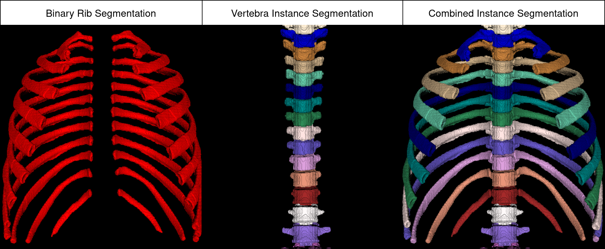
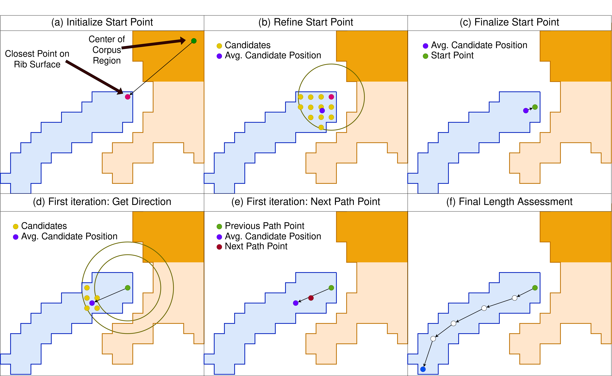

# Automated Thoracolumbar Stump Rib Detection and Analysis in a Large CT Cohort

<div align="center">
<a href="https://github.com/Hendrik-code/rib-segmentation/blob/main/figures/img_ribfeatures.png"></a>
</div>

This is the official code belonging to the paper "Automated Thoracolumbar Stump Rib Detection and Analysis in a Large CT Cohort".

If you use this code or the data provided below, please cite the following paper:
```
TBD
```


## Code

Here you can find the algorithms used in the paper. In order to not run all steps individually, we combined all steps into one function.
```python
!pip install TPTBox

from run import run_all_steps
from TPTBox import NII

outputs = run_all_steps(rib_mask: NII, vertebra_mask: NII)
```

### 1 Instance Rib Assignment



Inputting a Rib semantic mask and a vertebra instance annotation, this will combine both masks and assign the connected components of the rib annotation to the vertebra instances, yielding a combined instance segmentation mask.

### 2 Rib Length Measurement



This measurement algorithm takes the combined instance mask as input (and some parameters) and calculates points on the path of the rib segmentation to calculate its length.


### 3 Rib Features

<div align="center">
<a href="https://github.com/Hendrik-code/rib-segmentation/blob/main/figures/img_ribfeatures.png"></a>
</div>


A last step is to calculate the morphological features that were used in the paper to classify stump ribs even in partial views.
This takes the combined instance mask as well as the output of the rib length measurement algorithm and returns calculated features.


## Data

The rib segmentation masks for the public VerSe and RibFrac datasets can be found here: https://zenodo.org/records/14850929

The model weights for the rib segmentation model trained in the paper can also be downloaded from there and run with the nnUNet framework (https://github.com/MIC-DKFZ/nnUNet)


## Authorship

This pipeline was created by Hendrik Möller, M.Sc. (he/him)<br>
PhD Researcher at Department for Interventional and Diagnostic Neuroradiology

Developed within an ERC Grant at<br>
University Hospital rechts der Isar at Technical University of Munich<br>
Ismaninger Street 22, 81675 Munich

https://deep-spine.de/<br>
https://aim-lab.io/author/hendrik-moller/


## License

Copyright 2023 Hendrik Möller

Licensed under the Apache License, Version 2.0 (the "License");
you may not use this file except in compliance with the License.
You may obtain a copy of the License at

    http://www.apache.org/licenses/LICENSE-2.0

Unless required by applicable law or agreed to in writing, software
distributed under the License is distributed on an "AS IS" BASIS,
WITHOUT WARRANTIES OR CONDITIONS OF ANY KIND, either express or implied.
See the License for the specific language governing permissions and
limitations under the License.